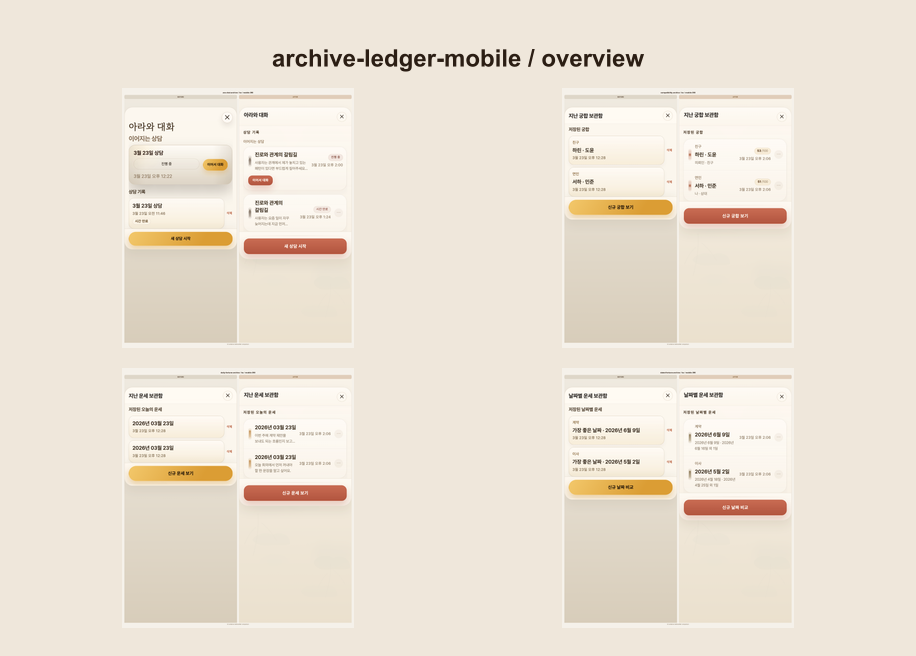

# ui-evidence

[한국어 README](./README.ko.md)

> AI changed the UI. Review the evidence.

`ui-evidence` helps you review what AI actually changed in the UI. It captures stable before/after screenshots or current UI snapshots, builds side-by-side comparisons, and generates a local review page a human can scan quickly.

I built it after AI coding tools started changing the wrong UI or quietly skipping related screens during frontend work. It became useful immediately in a real design-system rollout because missing screens and inconsistent button updates were easy to spot.

## Why it exists

- AI can touch the wrong UI while fixing a small frontend task.
- AI can miss related screens during a design-system rollout.
- Chat screenshots are a poor review surface when a human needs to scan multiple screens quickly.

## What it does

- captures stable UI screens with Playwright
- compares `before` and `after` images
- writes a local `review/index.html`
- supports `main` or another git ref as the `before` baseline
- attaches to an already running app when you do not want ui-evidence to launch the server
- resumes long runs and skips raw captures that already succeeded
- captures the current UI into a history snapshot bundle when you only need human review
- scaffolds repo-local bootstrap files after the skill or package is installed

The package is the local CLI. The skill is the easiest install surface for Codex, Claude Code, and other `SKILL.md`-based clients.
The skill gets the workflow into the agent. The package provides the repo-local executable that actually runs captures.

## Real output

### Archive ledger mobile button refresh

This showcase captures a real mobile archive flow before and after a button design-system rollout. One run covers four related screens, builds pair comparisons, and produces a review surface a human can scan quickly.



Artifacts:

- [before captures](./docs/showcase/archive-ledger-mobile/before/)
- [after captures](./docs/showcase/archive-ledger-mobile/after/)
- [pair comparisons](./docs/showcase/archive-ledger-mobile/comparison/pairs/)
- [overview image](./docs/showcase/archive-ledger-mobile/comparison/overview/archive-ledger-mobile__mobile-390__overview.png)
- [review HTML (open locally)](./docs/showcase/archive-ledger-mobile/review/index.html)
- [manifest](./docs/showcase/archive-ledger-mobile/manifest.json)

## Works with

- the open agent skills ecosystem through `SKILL.md`
- Codex, Claude Code, and other clients that support `skills add`
- local web apps with a stable route and wait target
- repos where `before` can come from the current checkout, a running URL, or another git ref

## Supported project types

- single-package Next.js apps
- single-package Vite/React apps
- Storybook setups with a stable review route
- generic web apps that can be opened by URL and waited on with a stable selector
- JavaScript workspaces using `pnpm`, `yarn`, or `npm` workspaces where the review app lives under a declared workspace package such as `apps/*` or `packages/*`

Current limit:

- arbitrary nested apps without workspace metadata are not a discovery target yet

## Install

### Skill-first install

Install the skill with the ecosystem-native installer:

```bash
pnpm dlx skills add 0xBrewing/ui-evidence
pnpm dlx skills add 0xBrewing/ui-evidence -a codex
pnpm dlx skills add 0xBrewing/ui-evidence -a claude-code
pnpm dlx skills add 0xBrewing/ui-evidence -g -a codex
```

Interactive install lets the user choose the target agent, project or global scope, and symlink or copy mode.

Equivalent `npx skills add ...` commands work too.

By convention, the skill lands in:

- `.agents/skills/` for Codex and other `.agents` clients
- `.claude/skills/` for Claude Code

After the skill is installed, ask the agent to use it. On first use, the skill installs the `ui-evidence` package into the current repo and runs the repo bootstrap step automatically.

That bootstrap aligns with agent-native paths too. It writes repo-local skill copies to `.agents/skills/ui-evidence/` for Codex and `.claude/skills/ui-evidence/` for Claude Code, so `skills add` installs and `installation.md` bootstrap converge on recognized locations.

Shortest prompt after install:

```text
Use ui-evidence to compare the checkout modal against main.
```

### Direct CLI install

If you want the package without using `skills add`, install it from GitHub:

```bash
pnpm add -D github:0xBrewing/ui-evidence
pnpm exec ui-evidence install --agent both --config ./ui-evidence.config.yaml
pnpm exec ui-evidence doctor --config ./ui-evidence.config.yaml
pnpm exec ui-evidence doctor --config ./ui-evidence.config.yaml --deep
```

Equivalent install commands:

```bash
npm install -D github:0xBrewing/ui-evidence
yarn add -D github:0xBrewing/ui-evidence
bun add -d github:0xBrewing/ui-evidence
```

This direct CLI path still bootstraps the same agent-native local skill locations: `.agents/skills/ui-evidence/` and `.claude/skills/ui-evidence/`.

### For LLM setup

If you want to hand an installation playbook to an LLM directly:

```text
Read https://raw.githubusercontent.com/0xBrewing/ui-evidence/main/docs/installation.md
and set up ui-evidence for this repository.
Prefer the installed ui-evidence skill if it is already available.
Keep the first setup minimal and ask only about unresolved route, wait target, auth, or baseline details.
```

If `ui-evidence` is already installed in the repo, this also works:

```text
Read node_modules/ui-evidence/docs/installation.md and set up ui-evidence for this repository.
```

## Quick start

Run one stage:

```bash
pnpm exec ui-evidence run --config ./ui-evidence.config.yaml --stage primary-flow
```

Compare the current branch against `main`:

```bash
pnpm exec ui-evidence run --config ./ui-evidence.config.yaml --stage primary-flow --before-ref main
```

Attach to an already running app and resume only the missing or failed raw captures:

```bash
pnpm exec ui-evidence run --config ./ui-evidence.config.yaml --stage primary-flow --after-attach http://127.0.0.1:3000 --resume
```

Capture the current UI only:

```bash
pnpm exec ui-evidence snapshot --config ./ui-evidence.config.yaml --scope design-system-rollout
```

Open:

```text
screenshots/ui-evidence/<stage-id>/review/index.html
```

## Common prompts

- `Use ui-evidence to compare the checkout modal against main`
- `Capture before and after screenshots for the login screen`
- `Bootstrap ui-evidence for this repo and keep the first setup minimal`

## Open skill bundle

This repo ships the standard pieces expected by the open skills ecosystem:

- [`skills/ui-evidence/SKILL.md`](./skills/ui-evidence/SKILL.md)
- [`skills/ui-evidence/agents/openai.yaml`](./skills/ui-evidence/agents/openai.yaml)
- [`.claude-plugin/marketplace.json`](./.claude-plugin/marketplace.json)

The Claude plugin mirror is generated into `plugins/ui-evidence/` from the canonical skill source during `prepare`, and is intentionally not committed so marketplace indexing sees only the canonical skill path.

## Minimal config shape

```yaml
version: 1
project:
  name: my-app
  rootDir: .
artifacts:
  rootDir: screenshots/ui-evidence
capture:
  baseUrl: http://127.0.0.1:3000
  browser:
    headless: true
  viewports:
    - id: mobile-390
      device: iPhone 13
      viewport:
        width: 390
        height: 844
servers:
  after:
    command: pnpm dev
    baseUrl: http://127.0.0.1:3000
stages:
  - id: primary-flow
    title: Primary Flow
    description: Stable UI surface for before/after review.
    defaultViewports:
      - mobile-390
    screens:
      - id: home
        label: Home
        path: /
        waitFor:
          testId: screen-home
scopes:
  - id: design-system-rollout
    title: Design System Rollout
    description: Current UI snapshot for touched and related screens.
    targets:
      - stageId: primary-flow
        screenIds:
          - home
```

## Output

Each stage writes:

```text
screenshots/ui-evidence/<stage-id>/
  before/
  after/
  comparison/
    pairs/
    overview/
  review/
    index.html
  notes.<lang>.md
  report.<lang>.md
  manifest.json
```

Snapshot runs write:

```text
screenshots/ui-evidence/snapshots/<run-id>/
  captures/
  overview/
  review/
    index.html
  notes.<lang>.md
  report.<lang>.md
  manifest.json
```

## Repository files worth reading

- [docs/installation.md](./docs/installation.md)
- [examples/generic-web/ui-evidence.config.yaml](./examples/generic-web/ui-evidence.config.yaml)
- [skills/ui-evidence/SKILL.md](./skills/ui-evidence/SKILL.md)

## Contributing

Issues and pull requests are welcome.

If you want to improve setup UX, skill metadata, or HTML review output, start with:

- [README.md](./README.md)
- [docs/installation.md](./docs/installation.md)
- [skills/ui-evidence/SKILL.md](./skills/ui-evidence/SKILL.md)

## License

[MIT](./LICENSE)
